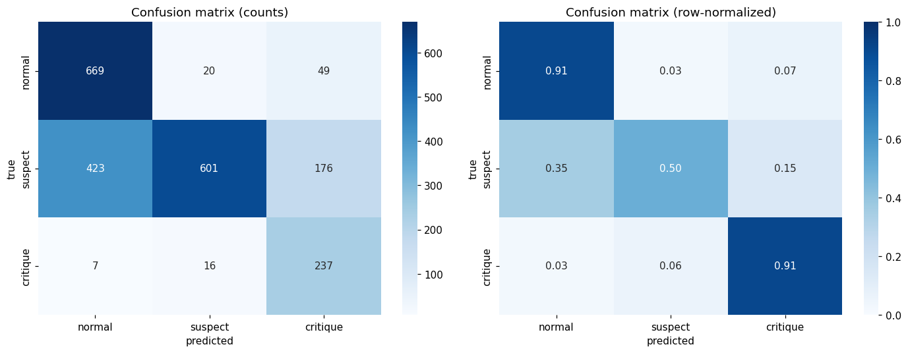
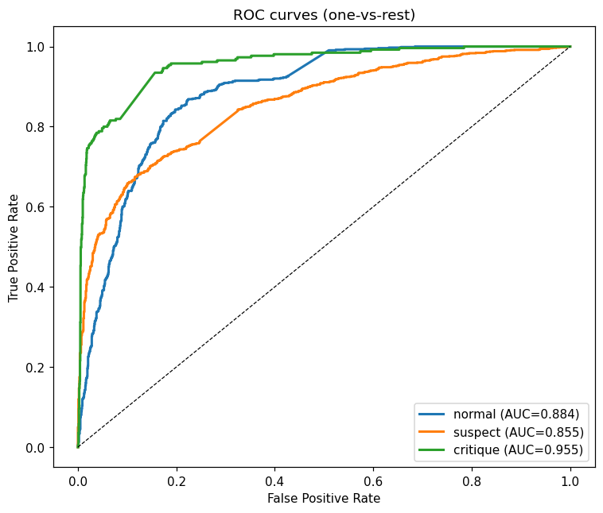
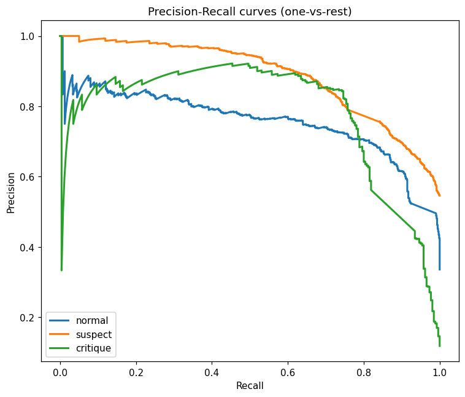
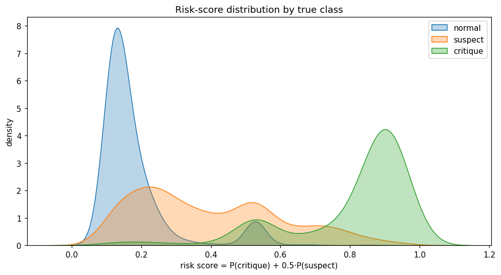

# Modèle A — Validation Report

## 1. Modèle et entraînement

- **Paramètres** : 578,659
- **Epochs entraînés** : 11
- **Best val macro-AUC** : 0.9107
- **Checkpoint** : `D:\stage\risk_classification_ECG12_signals-main\models\modelA\modelA_best.pt`

## 2. Performance globale (test fold 10)

- **Macro AUC-ROC** : 0.8979
- **Weighted AUC-ROC** : 0.8765
- **Accuracy** : 0.6856

## 3. Métriques par classe (seuil 0.5)

| classe | support | sensibilité | spécificité | PPV | F1 | AUC | AUC IC95% | FP | FN |
|---|---:|---:|---:|---:|---:|---:|:---:|---:|---:|
| **normal** | 738 | 0.900 | 0.716 | 0.615 | 0.731 | 0.884 | [0.872, 0.898] | 415 | 74 |
| **suspect** | 1200 | 0.466 | 0.971 | 0.951 | 0.625 | 0.855 | [0.840, 0.870] | 29 | 641 |
| **critique** | 260 | 0.788 | 0.957 | 0.709 | 0.747 | 0.955 | [0.943, 0.965] | 84 | 55 |

## 4. Visualisations

### Confusion Matrix

### Roc Curves

### Pr Curves

### Risk Distribution

## 5. Conformité & limites

- Système d'aide à la décision — usage académique uniquement.
- Données PTB-XL anonymisées (RGPD compliant).
- Le modèle classifie l'**état cardiaque sur un snapshot 10 s** ; ce n'est pas une prédiction de décompensation HF à 30 s–1 min (absence de labels temporels dans PTB-XL).
- Le mapping SCP→classe est documenté dans `scripts/modelA/label_mapping.py` et reste discutable aux frontières.
