# EDA Report — `ptbxl_database`

_PTB-XL ECG database metadata: demographics, recording info, SCP-ECG diagnostic codes, signal quality annotations and stratification folds for ~22k 12-lead ECG recordings._

## 1. Dataset overview

- **Source file:** `D:\stage\risk_classification_ECG12_signals-main/data/ptbxl_database.csv` (6.29 MB)
- **Rows × columns:** 21,799 × 28
- **Memory footprint:** 20.17 MB
- **Missing cells:** 207,478 (33.99%)
- **Duplicated rows:** 0

### Column types

|    | dtype          |   n_columns |
|---:|:---------------|------------:|
|  0 | str            |          13 |
|  1 | float64        |           7 |
|  2 | int64          |           3 |
|  3 | bool           |           3 |
|  4 | datetime64[us] |           1 |
|  5 | object         |           1 |

## 2. Data quality

### Missing values (top 30)

|                              |   missing_count |   missing_pct | dtype          |
|:-----------------------------|----------------:|--------------:|:---------------|
| electrodes_problems          |           21769 |         99.86 | str            |
| infarction_stadium2          |           21696 |         99.53 | str            |
| pacemaker                    |           21508 |         98.67 | str            |
| burst_noise                  |           21187 |         97.19 | str            |
| baseline_drift               |           20201 |         92.67 | str            |
| extra_beats                  |           19850 |         91.06 | str            |
| static_noise                 |           18539 |         85.05 | str            |
| infarction_stadium1          |           16187 |         74.26 | str            |
| height                       |           14825 |         68.01 | float64        |
| weight                       |           12378 |         56.78 | float64        |
| validated_by                 |            9378 |         43.02 | float64        |
| heart_axis                   |            8468 |         38.85 | str            |
| nurse                        |            1473 |          6.76 | float64        |
| site                         |              17 |          0.08 | float64        |
| report                       |               2 |          0.01 | str            |
| device                       |               0 |          0    | str            |
| ecg_id                       |               0 |          0    | int64          |
| patient_id                   |               0 |          0    | float64        |
| age                          |               0 |          0    | float64        |
| sex                          |               0 |          0    | int64          |
| scp_codes                    |               0 |          0    | object         |
| recording_date               |               0 |          0    | datetime64[us] |
| second_opinion               |               0 |          0    | bool           |
| initial_autogenerated_report |               0 |          0    | bool           |
| validated_by_human           |               0 |          0    | bool           |
| strat_fold                   |               0 |          0    | int64          |
| filename_lr                  |               0 |          0    | str            |
| filename_hr                  |               0 |          0    | str            |

### Cleaning actions

| Action | Result |
|---|---|
| Parsed list columns | — |
| Parsed dict columns | scp_codes |
| Parsed datetime columns | recording_date |
| Coerced boolean columns | — |
| Fully-null columns | — |
| Constant columns | — |
| Duplicate rows | 0 |
| Duplicate identifiers | patient_id: 2,930 |

## 3. Statistical summary

### Numeric columns

|              |   count |     mean |     std |   min |   25% |   50% |   75% |   max |
|:-------------|--------:|---------:|--------:|------:|------:|------:|------:|------:|
| age          |   21799 |  62.7693 | 32.3088 |     2 |    50 |    62 |    72 |   300 |
| sex          |   21799 |   0.4792 |  0.4996 |     0 |     0 |     0 |     1 |     1 |
| height       |    6974 | 166.702  | 10.8673 |     6 |   160 |   166 |   174 |   209 |
| weight       |    9421 |  70.9952 | 15.8788 |     5 |    60 |    70 |    80 |   250 |
| nurse        |   20326 |   2.2917 |  3.254  |     0 |     0 |     1 |     3 |    11 |
| site         |   21782 |   1.5449 |  4.1729 |     0 |     0 |     1 |     2 |    50 |
| validated_by |   12421 |   0.7461 |  1.178  |     0 |     0 |     1 |     1 |    11 |
| strat_fold   |   21799 |   5.503  |  2.8749 |     1 |     3 |     6 |     8 |    10 |

### Skewness & kurtosis

|              |    skew |   kurtosis |
|:-------------|--------:|-----------:|
| age          |  5.1641 |    36.3289 |
| sex          |  0.0835 |    -1.9932 |
| height       | -2.0074 |    24.9516 |
| weight       |  1.2957 |     6.9513 |
| nurse        |  1.4297 |     0.6877 |
| site         |  6.939  |    54.8571 |
| validated_by |  3.4196 |    15.4216 |
| strat_fold   |  0.0005 |    -1.2265 |

### Outliers (IQR rule)

|              |   outliers_iqr |   n_non_null |   outlier_pct |
|:-------------|---------------:|-------------:|--------------:|
| age          |            385 |        21799 |          1.77 |
| sex          |              0 |        21799 |          0    |
| height       |             34 |         6974 |          0.49 |
| weight       |            127 |         9421 |          1.35 |
| nurse        |           2488 |        20326 |         12.24 |
| site         |            739 |        21782 |          3.39 |
| validated_by |            608 |        12421 |          4.89 |
| strat_fold   |              0 |        21799 |          0    |

### Categorical columns

| column                       |   n_unique | top                       |   top_freq |   top_pct |
|:-----------------------------|-----------:|:--------------------------|-----------:|----------:|
| device                       |         11 | CS100    3                |       6140 |     28.17 |
| report                       |       9886 | sinus rhythm. normal ecg. |       1734 |      7.95 |
| heart_axis                   |          8 | MID                       |       7687 |     35.26 |
| infarction_stadium1          |          6 | unknown                   |       3430 |     15.73 |
| infarction_stadium2          |          3 | Stadium III               |         65 |      0.3  |
| second_opinion               |          2 | False                     |      21244 |     97.45 |
| initial_autogenerated_report |          2 | False                     |      14986 |     68.75 |
| validated_by_human           |          2 | True                      |      16056 |     73.65 |
| baseline_drift               |        315 | , V6                      |        221 |      1.01 |
| static_noise                 |        124 | , I-AVR,                  |        953 |      4.37 |
| burst_noise                  |        102 | alles                     |        140 |      0.64 |
| electrodes_problems          |         14 | V6                        |          8 |      0.04 |
| extra_beats                  |        128 | 1ES                       |        405 |      1.86 |
| pacemaker                    |          4 | ja, pacemaker             |        285 |      1.31 |

### Datetime columns

|                | min                 | max                 |   range_days |   n_non_null |
|:---------------|:--------------------|:--------------------|-------------:|-------------:|
| recording_date | 1984-11-09 09:17:34 | 2001-06-11 16:43:01 |         6058 |        21799 |

## 4. Feature analysis

### Cardinalities (top 20)

|                              |   n_unique |
|:-----------------------------|-----------:|
| ecg_id                       |      21799 |
| filename_hr                  |      21799 |
| filename_lr                  |      21799 |
| recording_date               |      21795 |
| patient_id                   |      18869 |
| report                       |       9886 |
| scp_codes                    |       5463 |
| baseline_drift               |        315 |
| extra_beats                  |        128 |
| weight                       |        127 |
| static_noise                 |        124 |
| burst_noise                  |        102 |
| age                          |         89 |
| height                       |         77 |
| site                         |         51 |
| electrodes_problems          |         14 |
| nurse                        |         12 |
| validated_by                 |         12 |
| device                       |         11 |
| strat_fold                   |         10 |
| heart_axis                   |          8 |
| infarction_stadium1          |          6 |
| pacemaker                    |          4 |
| infarction_stadium2          |          3 |
| sex                          |          2 |
| validated_by_human           |          2 |
| second_opinion               |          2 |
| initial_autogenerated_report |          2 |

**High-cardinality text columns:** `scp_codes`

### Label distribution — `heart_axis`

| heart_axis   |   count |
|:-------------|--------:|
| nan          |    8468 |
| MID          |    7687 |
| LAD          |    3764 |
| ALAD         |    1382 |
| RAD          |     221 |
| ARAD         |     122 |
| AXL          |     101 |
| AXR          |      51 |
| SAG          |       3 |

### Label distribution — `sex`

|   sex |   count |
|------:|--------:|
|     0 |   11354 |
|     1 |   10445 |

### Top labels in `scp_codes`

|         |   count |
|:--------|--------:|
| SR      |   16748 |
| NORM    |    9514 |
| ABQRS   |    3327 |
| IMI     |    2676 |
| ASMI    |    2357 |
| LVH     |    2132 |
| NDT     |    1825 |
| LAFB    |    1623 |
| AFIB    |    1514 |
| ISC_    |    1272 |
| PVC     |    1143 |
| IRBBB   |    1118 |
| STD_    |    1009 |
| VCLVH   |     875 |
| STACH   |     826 |
| 1AVB    |     793 |
| IVCD    |     787 |
| SARRH   |     772 |
| NST_    |     767 |
| ISCAL   |     659 |
| SBRAD   |     637 |
| QWAVE   |     548 |
| CRBBB   |     541 |
| CLBBB   |     536 |
| ILMI    |     478 |
| LOWT    |     438 |
| LAO/LAE |     426 |
| NT_     |     423 |
| PAC     |     398 |
| AMI     |     353 |

### Derived feature — `age_by_sex`

|   sex |   count |   mean |   std |   min |   25% |   50% |   75% |   max |
|------:|--------:|-------:|------:|------:|------:|------:|------:|------:|
|     0 |   11354 |  60.2  | 24.18 |     2 |    50 |    61 |    70 |   300 |
|     1 |   10445 |  65.56 | 39.09 |     3 |    50 |    64 |    75 |   300 |

### Derived feature — `scp_codes_per_record`

|       |   scp_codes |
|:------|------------:|
| count |    21799    |
| mean  |        2.8  |
| std   |        1.21 |
| min   |        1    |
| 25%   |        2    |
| 50%   |        2    |
| 75%   |        3    |
| max   |        9    |

## 5. Visualizations

### Missing Values

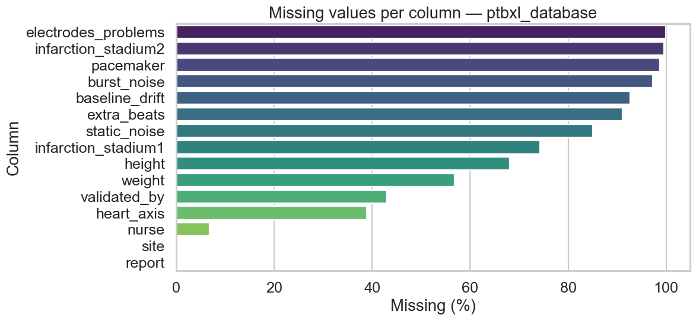

### Dtype Distribution

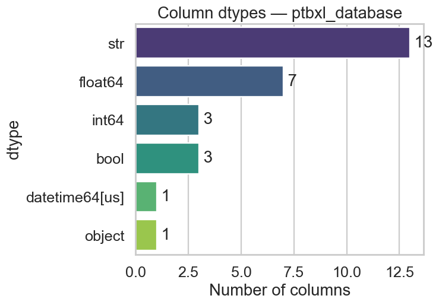

### Numeric Distributions

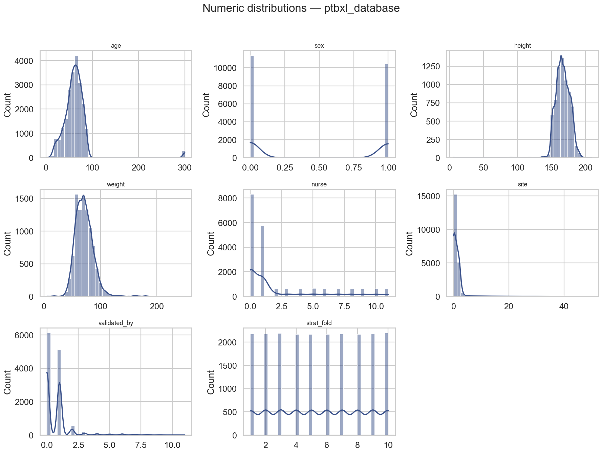

### Outliers Boxplot

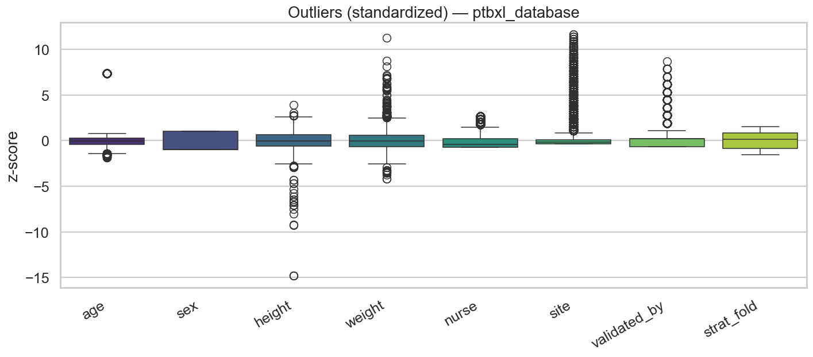

### Correlation Heatmap

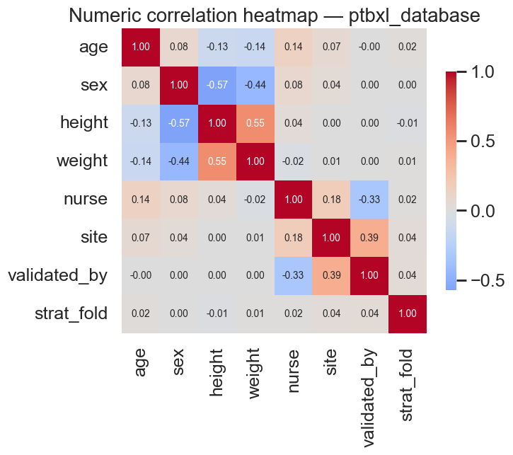

### Class Balance Heart Axis

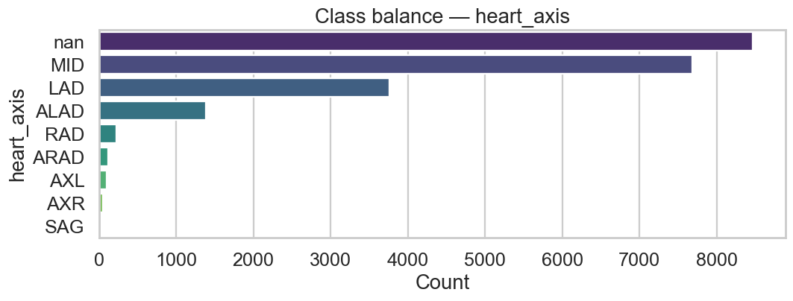

### Class Balance Sex

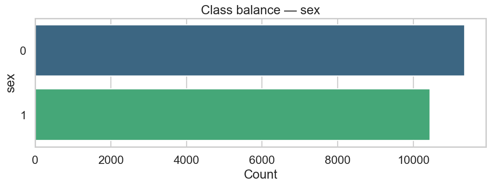

### Multilabel Top Scp Codes

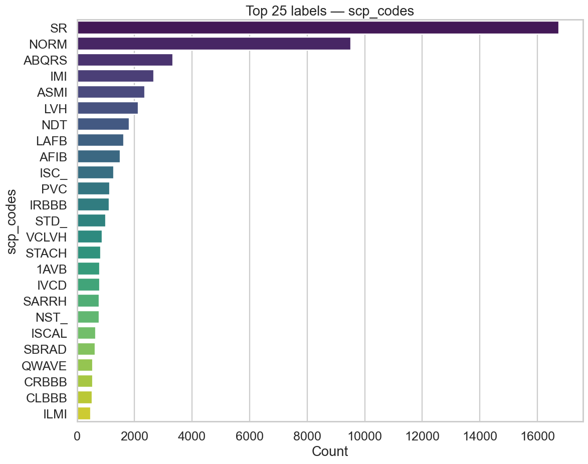

### Timeseries Recording Date

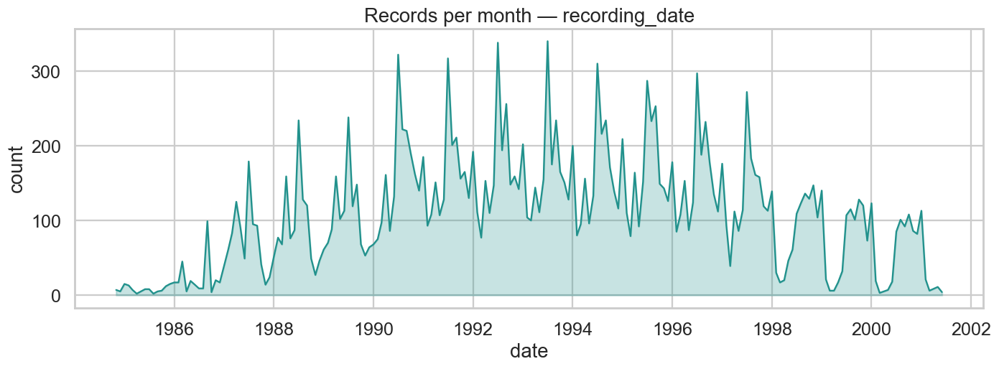

### Timeseries Year Recording Date

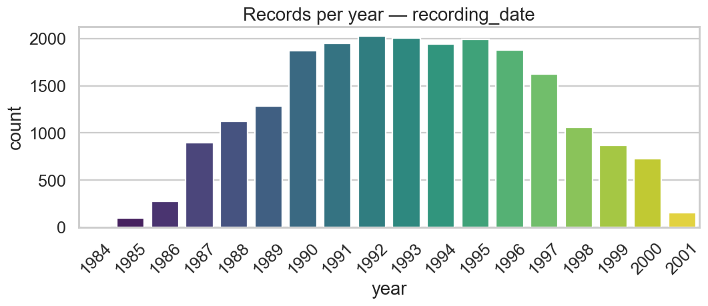

### Age Sex Pyramid

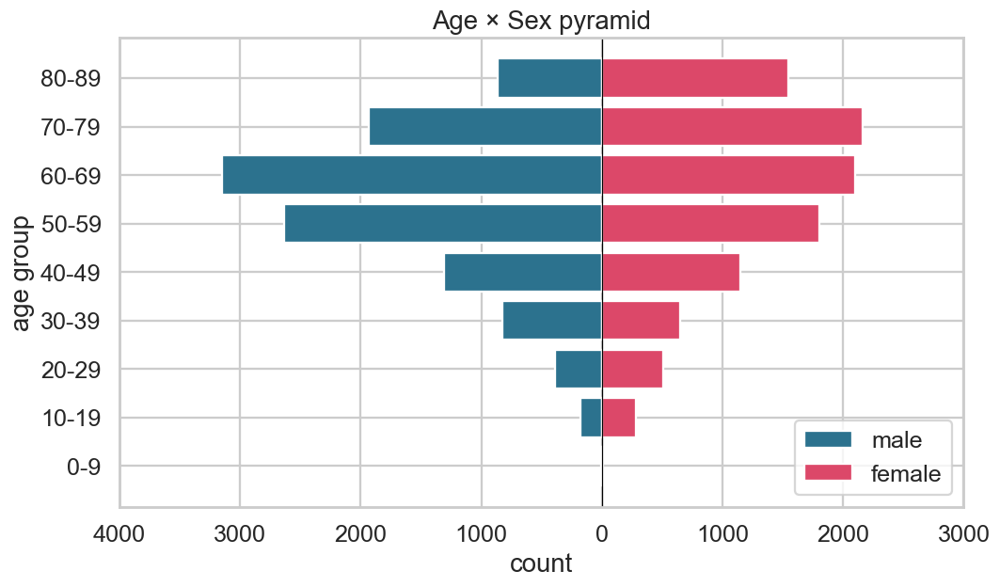

## 6. Key insights

- Overall missingness is **33.99%** across 21,799 rows × 28 columns.
- Most incomplete columns: `electrodes_problems` (99.9%), `infarction_stadium2` (99.5%), `pacemaker` (98.7%).
- Duplicate identifier values detected: `patient_id` (2,930).
- Highest IQR-outlier rates: `nurse` (12.2%), `validated_by` (4.9%), `site` (3.4%).
- Strongest numeric correlation: `height` ↔ `sex` (|r| = 0.57).
- `heart_axis` is dominated by **nan** (38.8% of records).
- `sex` is dominated by **0** (52.1% of records).
- `scp_codes` contains **71** distinct labels across **61,007** mentions; most frequent is **SR** (27.5%).
- `recording_date` spans 1984-11-09 → 2001-06-11 (6058 days, 21,799 non-null).
- Each ECG carries on average 2.80 SCP codes (min 1, max 9).
